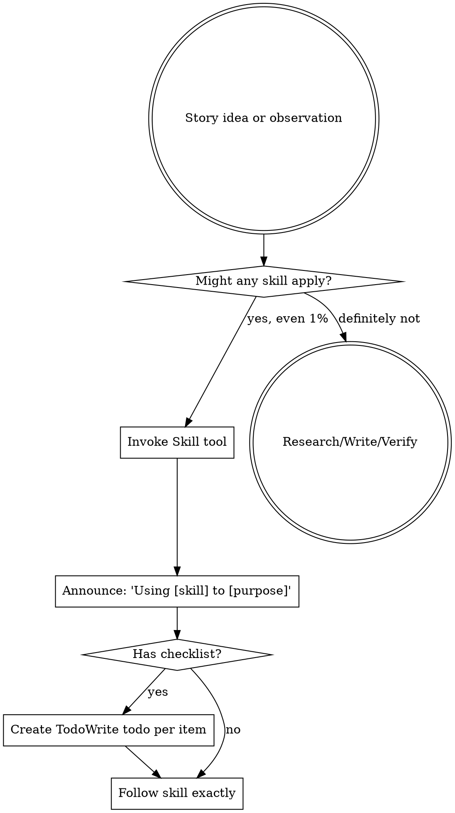

<EXTREMELY-IMPORTANT>
If you think there is even a 1% chance a narrative investigation skill might apply, you ABSOLUTELY MUST invoke the skill.

IF A SKILL APPLIES TO YOUR INVESTIGATIVE WORK, YOU DO NOT HAVE A CHOICE. YOU MUST USE IT.

This is not negotiable. This is not optional. You cannot rationalize your way out of this.
</EXTREMELY-IMPORTANT>

## How to Access Skills

**In Claude Code:** Use the `Skill` tool. When you invoke a skill, its content is loaded and presented to you—follow it directly. Never use the Read tool on skill files.

**In other environments:** Check your platform's documentation for how skills are loaded.

# Using Narrative Investigation Skills

## The Rule

**Invoke relevant or requested skills BEFORE any response or action.** Even a 1% chance a skill might apply means that you should invoke the skill to check. If an invoked skill turns out to be wrong for the situation, you don't need to use it.



## Red Flags - Investigative Edition

These thoughts mean STOP—you're rationalizing instead of using rigorous methodology:

| Thought | Reality |
|---------|---------|
| "This is just a simple question" | Questions lead to stories. Use interrogate skill. |
| "I need more context first" | Skill check comes BEFORE clarifying questions. |
| "Let me search for sources first" | Skills tell you HOW to search. Check first. |
| "I can make this claim quickly" | Claims need sources. Use fact-check-driven-revision. |
| "Let me gather information first" | Skills tell you HOW to gather information rigorously. |
| "This doesn't need formal research" | If a skill exists, use it. Rigor prevents errors. |
| "I remember this methodology" | Skills evolve. Read current version. |
| "This doesn't count as investigative work" | Any claim = research task. Check for skills. |
| "The skill is overkill for this" | Simple stories become complex. Use discipline. |
| "I'll just draft this one thing first" | Check BEFORE drafting. Fact-check-driven means claims after sources. |
| "This feels productive" | Undisciplined research wastes time and misleads readers. |
| "I know journalism basics" | Knowing the concept ≠ using the skill. Invoke it. |
| "I can verify this later" | Verify BEFORE publishing. No unsourced claims. |

## Skill Priority for Investigative Work

When multiple skills could apply, use this order:

1. **Investigation skills first** (interrogate, story-plan) - these determine WHAT you're uncovering and HOW
2. **Research execution second** (evidence-driven-drafting) - these guide the actual research
3. **Verification always** (fact-check-driven-revision) - verify every claim before proceeding

Examples:
- "I noticed something strange..." → **interrogate** first (sharpen the angle)
- "I have a story prospectus" → **story-plan** second (create research plan)
- "I'm ready to research" → **evidence-driven-drafting** third (dispatch specialists)
- "I've drafted a section" → **fact-check-driven-revision** always (verify claims)

## Narrative Investigation Workflow

### Starting a Story

```
Observation/Question
    ↓
interrogate (Socratic questioning)
    ↓
Story Prospectus (validated in sections)
    ↓
story-plan (research & drafting plan)
    ↓
evidence-driven-drafting (specialist agents)
    ↓
fact-check-driven-revision (verify all claims)
    ↓
peer-scrutiny (editorial + ethical review)
    ↓
Publication with source package
```

### Specialist Agents

When researching, the evidence-driven-drafting skill dispatches these specialist agents:

- **@archivist** - Primary sources, historical records, documents
- **@analyst** - Data interpretation, financial analysis, statistics
- **@ethicist** - Harm assessment, power dynamics, missing voices
- **@narrator** - Voice calibration, emotional arc, story structure
- **@skeptic** - Challenge claims, test logic, devil's advocate
- **@community-listener** - Affected community perspectives, representation

Each agent is fresh (no context contamination) and specialized for their task.

## Skill Types for Journalism

**Rigid** (fact-check-driven-revision, ethical review): Follow exactly. Don't skip verification.

**Guided** (interrogate, story-plan): Follow process but adapt questions to the story.

**Orchestration** (evidence-driven-drafting): Coordinate specialists systematically.

The skill itself tells you which approach to use.

## Core Principles

### Evidence Before Claims
- **Never assert without sources**
- **Mark inferences explicitly** with [INFERENCE - NEEDS VERIFICATION]
- **Qualify uncertainty** with "appears," "suggests," "may"
- **Cite everything**: URL, date accessed, page/section

### Ethics at Every Step
- **Harm assessment**: Who could be hurt by this reporting?
- **Missing voices**: Who should be consulted?
- **Power analysis**: Are structural forces acknowledged?
- **Representation**: Dignified portrayal? Stereotypes avoided?

### Methodology Transparency
- **Document how you found things**, not just what you found
- **Note limitations**: What data doesn't show, alternative explanations
- **Confidence ratings**: High (primary source) / Medium (verified secondary) / Low (single source)
- **Save source notes** with every research task

### Community-Centered
- **Stories serve those affected**, not just audiences
- **Consult, don't extract**: Include community voice in the process
- **Actionable information**: What can readers/community do with this?
- **Resistance acknowledged**: Not just suffering, but organizing and victories

## Common Investigative Tasks → Skills Mapping

| Task | Skill to Use |
|------|--------------|
| "I noticed something unusual..." | interrogate |
| "What should I investigate about X?" | interrogate |
| "I have a story idea" | interrogate |
| "I need a research plan" | story-plan |
| "Ready to start researching" | evidence-driven-drafting |
| "I need to find property records" | evidence-driven-drafting → @archivist |
| "I need to analyze this dataset" | evidence-driven-drafting → @analyst |
| "Is this claim too strong?" | fact-check-driven-revision |
| "I've drafted a paragraph" | fact-check-driven-revision |
| "Could this harm anyone?" | evidence-driven-drafting → @ethicist |
| "Does this logic hold up?" | evidence-driven-drafting → @skeptic |
| "How would the community respond?" | evidence-driven-drafting → @community-listener |
| "Is the narrative arc working?" | evidence-driven-drafting → @narrator |

## Dual-Mode System

This system supports both **investigative journalism** and **software development** workflows:

- **Narrative skills**: interrogate, story-plan, evidence-driven-drafting, fact-check-driven-revision
- **Code skills**: brainstorming, writing-plans, subagent-driven-development, test-driven-development

Both modes share the same architecture (skills system, subagent orchestration, verification at every step).

See [docs/MIGRATION-TO-NARRATIVE.md](../../docs/MIGRATION-TO-NARRATIVE.md) for conceptual mapping between modes.

## Getting Started

**For a new story:**
1. Start with `/interrogate` or invoke the `interrogate` skill
2. Let Socratic questioning sharpen your investigative angle
3. Validate the story prospectus in sections
4. Proceed to `/story-plan` for detailed research planning

**For existing research:**
- Use `evidence-driven-drafting` to dispatch specialist agents
- Use `fact-check-driven-revision` to verify claims continuously

**Remember:** Skills are mandatory workflows, not suggestions. If you're doing investigative work, use the skills. They prevent the common pitfalls that undermine credibility: unsourced claims, missing context, overlooked harm, weak logic.

## File Structure for Investigative Writing

```
writing/
├── prospectuses/
│   └── YYYY-MM-DD-story-slug.md
├── plans/
│   └── YYYY-MM-DD-story-slug.md
├── drafts/
│   └── section-name.md
├── source-notes/
│   └── topic-name.md
└── field-notes/
    └── YYYY-MM-DD-location-or-interview.md
```

Save everything. Document methodology as you go. Git commits (or timestamped backups) create an audit trail.

## The Standard: Accountability

The goal isn't just to write compelling stories—it's to write **accountable** stories that can withstand scrutiny.

- Every claim sourced or marked as inference
- Every potential harm considered
- Every missing voice acknowledged
- Every methodological choice documented

Use the skills. They make this standard achievable.
